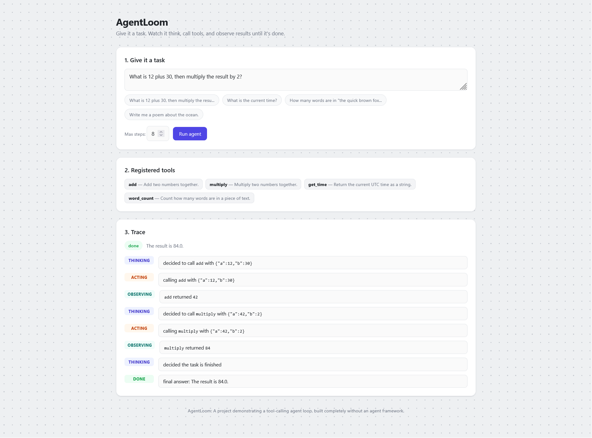
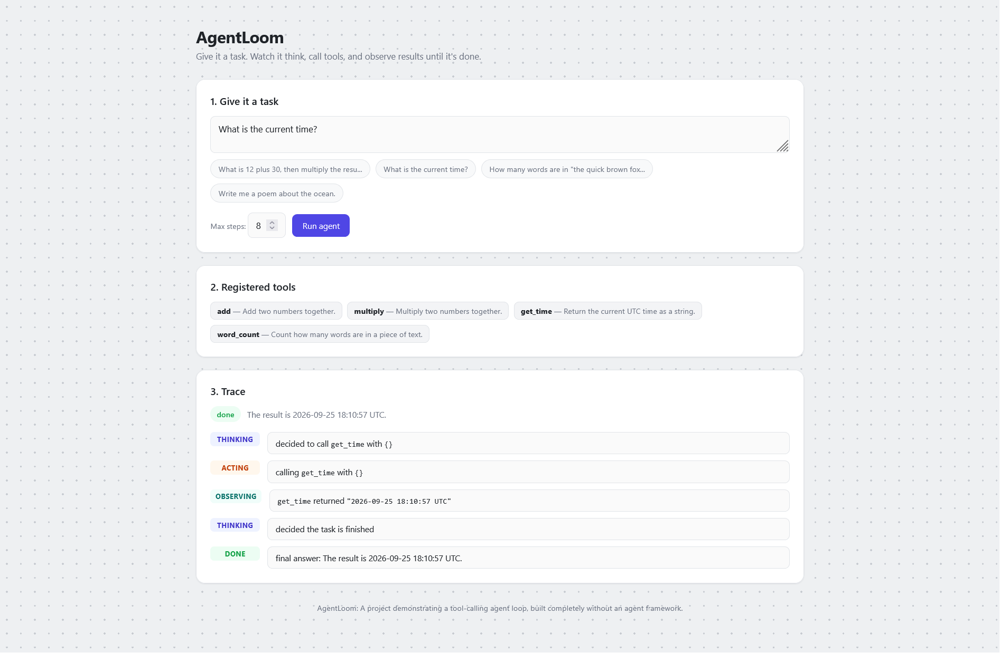
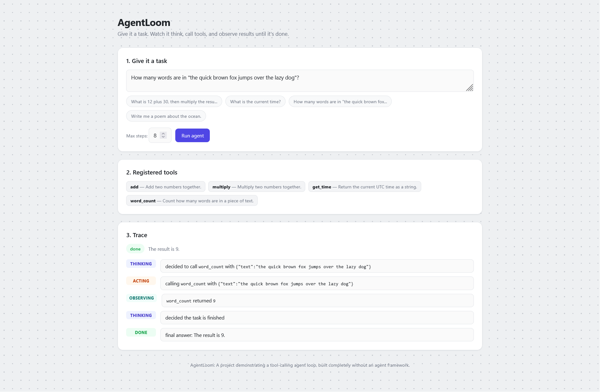
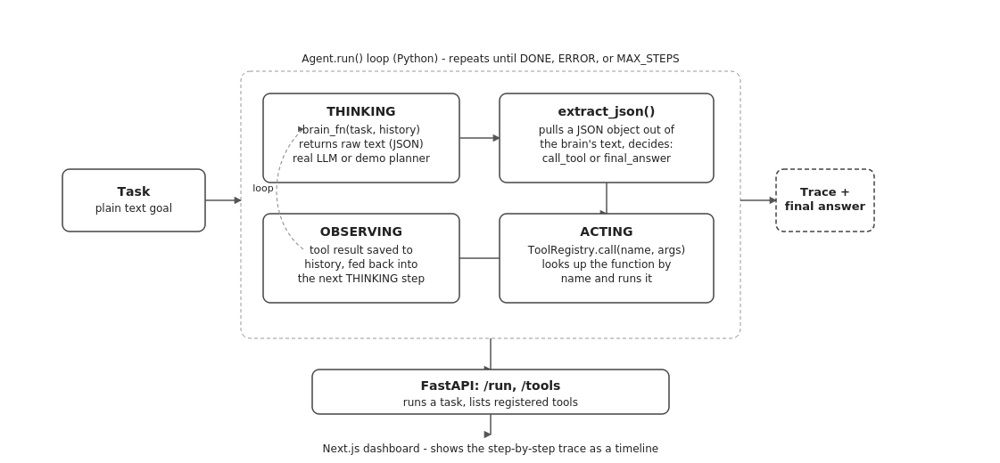

# AgentLoom

AgentLoom is a simple AI agent built from scratch. It does not use heavy frameworks like LangChain.

You give the agent a task in plain English. The agent asks an AI model what to do next. The model can choose to run a Python function or return a final answer. If it runs a function, AgentLoom executes the code, sends the result back to the model, and asks again. This loop continues until the task is complete.

This project has two main parts:
- A Python backend that handles the agent loop, tools, and JSON parsing.
- A Next.js web dashboard where you can watch the agent think and act step by step.

## Why I built this

I wanted to learn how AI agents work under the hood. Building this project by hand helped me understand how agents make decisions, run tools, and handle errors. You can read more about these design choices in the case study file.

## Screenshot







## How it works



The agent runs in five steps:

1. **Thinking** - The AI reads the task and past actions. It decides to call a tool or give a final answer.
2. **Parsing** - The program extracts the JSON decision from the text.
3. **Acting** - If the AI asks for a tool, the tool registry runs the matching Python function.
4. **Observing** - The program records the tool output and sends it back to the AI.
5. **Repeating** - The loop runs until the task is done or hits maximum steps.

## Project structure

```
agentloom/
  backend/
    agentloom/             -> main logic (state machine, tools, json parser)
    api.py                 -> FastAPI web server
    cli.py                 -> command line tool
    tests/                 -> unit tests
    requirements.txt
  frontend/
    app/                   -> Next.js web pages
    package.json
  docs/
    architecture-diagram.png
    dashboard-screenshot.png
  README.md
  case-study.md
```

## Running it yourself

### 1. Backend

```bash
cd backend
pip install -r requirements.txt
uvicorn api:app --reload --port 8000
```

Check if the server is running by opening `http://127.0.0.1:8000/health`.

You can also run a task directly in your terminal:

```bash
python cli.py "What is 12 plus 30, then multiply the result by 2?"
```

### 2. Frontend

```bash
cd frontend
npm install
npm run dev
```

Open `http://localhost:3000` in your browser to view the dashboard.

### 3. Tests

```bash
cd backend
pytest
```

## Using a real LLM

By default, the project uses a built-in demo planner. It uses basic math rules and costs no money.

To connect a real AI model, write a function like this:

```python
def brain(task: str, history: list) -> str:
    # Send task and history to your AI model
    # Return the response string containing JSON
    pass
```

Pass `brain=brain` when creating the agent.

## Adding new tools

Tools are normal Python functions registered with a decorator:

```python
from agentloom.tools import ToolRegistry

registry = ToolRegistry()

@registry.register()
def get_weather(city: str) -> str:
    """Look up current weather for a city."""
    pass
```

Pass this registry to your agent to let it use your new function.

## What this project does not do

- It does not make paid API calls by default.
- It runs one tool at a time in order.
- It does not save memory between separate runs.

## Tech used

- Python, FastAPI, Pytest
- Next.js, React, CSS

## License

Free to use for learning or portfolio projects.